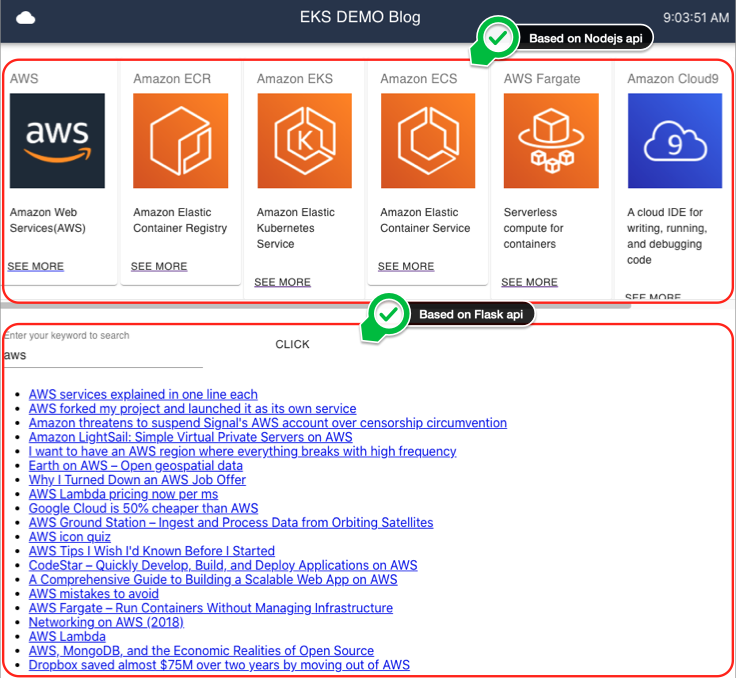

# EKS Demo Blog

## Microservices with EKS

This workshop is designed to educate engineers that might not be familiar with Kubernetes(k8s), Amazon EKS, Docker container workflow.

## Amazon EKS

Amazon Elastic Container Service (Amazon ECS) is a **fully managed container orchestration** service. ECS has been a foundational pillar for key Amazon services, it can **natively integrate** with other services such as Amazon Route 53, Secrets Manager, AWS Identity and Access Management (IAM), and Amazon CloudWatch providing you a familiar experience to deploy and scale your containers. ECS allows your applications the flexibility to use a mix of **Amazon EC2** and **AWS Fargate** with Spot and On-Demand pricing options.

## Purpose

- To understand Amazon ECS **fundermental concepts** and **new features**.
- To practice **useful tools** for Amazon ECS **management**.

## AWS services you will use

- Amazon Elastic Container Service (ECS)
- Amazon Elastic Container Resistry (ECR)
- AWS Fargate
- AWS FireLens
- Amazon CloudWatch
- Auto Scaling
- AWS Identity and Access Management (IAM)
- Amazon CloudFormation
- Amazon EC2
- Amazon Application Load Balancer (ALB)

## Architecture

## We will:

- Deploy AWS CloudFormation stack to set up prerequisites.
- Manage Docker images of **cats** and **dogs** in Amazon ECR.
- Create Amazon ECS **cluster, task definitions**, and **services**.
- Choose right **launch type** either **EC2** or **Fargate** for each service.
- Deploy simple containerized application **cats and dogs** path-routed through ALB.
- Monitor ECS cluster and services in Amazon CloudWatch **Container Insights**.
- Centralize **container logs** using **AWS FireLens** and Amazon CloudWatch Logs.
- Scale ECS **services** and **cluster** automatically.

## Start here:

[English]
https://www.eksworkshop.com/

[Korean]
https://main.d18gq8z65416af.amplifyapp.com/ko/
